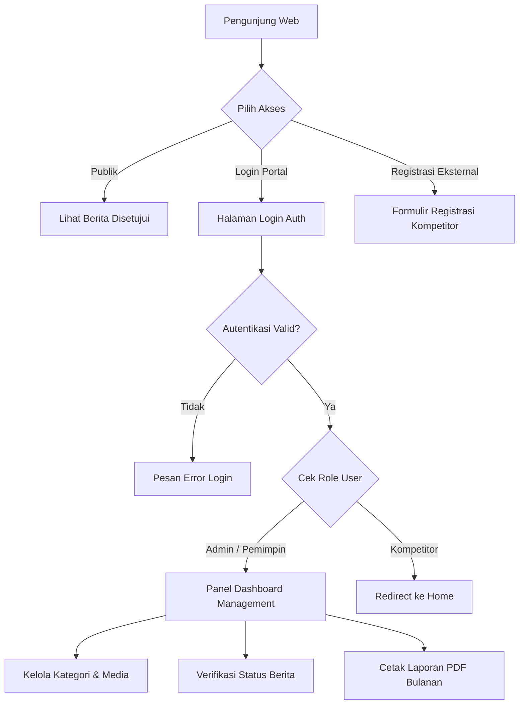

# Product Requirements Document (PRD)
## Sistem Monitoring Media Disnaker

---

### 1. Deskripsi Produk
Sistem Monitoring Media Disnaker adalah aplikasi web modern berbasis MVC yang memadukan portal berita publik front-end dengan panel manajemen back-end berbasis Role-Based Access Control (RBAC).

---

### 2. User Personas & User Stories

#### 2.1 User Story - Administrator
- **US-01**: Sebagai Admin, saya ingin login menggunakan email dan password agar dapat mengakses panel manajemen.
- **US-02**: Sebagai Admin, saya ingin mengelola data kategori berita (tambah, edit, hapus) agar berita terorganisir dengan rapi.
- **US-03**: Sebagai Admin, saya ingin mengunggah dan mengedit berita media lengkap dengan gambar pendukung dan URL sumber.
- **US-04**: Sebagai Admin, saya ingin menyetujui, menolak, atau mengubah status verifikasi berita.
- **US-05**: Sebagai Admin, saya ingin mengelola data user (Admin, Pemimpin, Kompetitor) dan hak aksesnya.

#### 2.2 User Story - Pemimpin
- **US-06**: Sebagai Pemimpin, saya ingin melihat dashboard statistik dan tren media berdasarkan bulan.
- **US-07**: Sebagai Pemimpin, saya ingin mengunduh laporan PDF tren pemberitaan bulanan untuk bahan rapat evaluasi.

#### 2.3 User Story - Publik / Kompetitor
- **US-08**: Sebagai Pengunjung Publik, saya ingin membaca berita ketenagakerjaan yang sudah disetujui tanpa perlu login.
- **US-09**: Sebagai Pendaftar Eksternal, saya ingin mendaftarkan akun kompetitor/instansi dengan mengisi formulir identitas.

---

### 3. User Flow Diagrams

---

### 4. Acceptance Criteria (Kriteria Penerimaan Fitur)

#### AC-01: Autentikasi & Otorisasi Sesi
- **GIVEN** Pengguna belum login.
- **WHEN** Mengakses URL `/media`, `/kategori`, `/user`, atau `/laporan`.
- **THEN** Sistem harus menolak akses dan mengarahkan pengguna ke `/auth/login` dengan pesan peringatan.

#### AC-02: Pengelolaan Berita Media
- **GIVEN** Admin mengisi formulir tambah media dengan gambar valid (.jpg, .png max 2MB).
- **WHEN** Formulir dikirimkan (submit).
- **THEN** Gambar tersimpan tersandi di `./uploads/`, data tersimpan di DB, dan sistem menampilkan pesan sukses.

#### AC-03: Ekspor Laporan PDF
- **GIVEN** Pemimpin memilih filter bulan tertentu di halaman laporan.
- **WHEN** Menekan tombol Cetak PDF.
- **THEN** File PDF bersih terunduh dengan orientasi Landscape A4 tanpa error header HTML.
