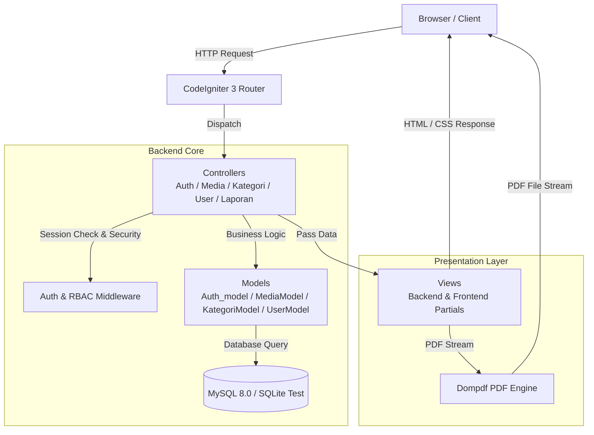

# System Architecture & Tech Stack
## Sistem Monitoring Media Disnaker

---

### 1. Arsitektur Sistem (MVC Pattern)
Aplikasi dibangun mengikuti pola arsitektur **Model-View-Controller (MVC)** yang memisahkan logika bisnis, presentasi antarmuka, dan manajemen data.



---

### 2. Teknologi & Stack Komponen (Tech Stack)

| Lapisan | Teknologi | Versi | Catatan |
| :--- | :--- | :--- | :--- |
| **Language** | PHP | `8.3.10` | CLI & Apache FPM |
| **Framework** | CodeIgniter | `3.1.x` | Framework MVC dengan patch PHP 8.3 |
| **Database (Prod)** | MySQL | `8.0` | Relational DBMS dengan InnoDB engine |
| **Database (Test)** | SQLite3 / PDO SQLite | `3.x` | In-memory & file DB terisolasi untuk testing |
| **PDF Engine** | Dompdf | `^3.0` | Generator dokumen PDF berformat A4 Landscape |
| **Testing** | PHPUnit + ci-phpunit-test | `9.6.22` | Automated Unit & Feature Test runner |
| **Container** | Docker & Docker Compose | `3.8` | PHP 8.3 Apache + MySQL 8.0 + phpMyAdmin |
| **CI/CD** | GitHub Actions | `v4` | Automated testing & container build validation |

---

### 3. Struktur Direktori Proyek

```text
disnaker-monitoring/
├── application/
│   ├── config/             # Konfigurasi aplikasi & database (default & testing)
│   ├── controllers/        # Controller MVC (Auth, Media, Kategori, User, Laporan, Cetak)
│   ├── models/             # Model database (Auth_model, MediaModel, KategoriModel, UserModel, Dashboard_model)
│   ├── views/              # View antarmuka (backend & frontend)
│   └── tests/              # PHPUnit test suite (models & controllers)
├── assets/                 # Asset statis (CSS, JS, Images, Vendors)
├── docs/                   # Dokumentasi sistem lengkap (13 bagian)
├── uploads/                # Direktori penyimpanan file gambar media
├── Dockerfile              # Container image PHP 8.3 Apache
├── docker-compose.yml      # Container orchestration
└── .github/workflows/      # Pipeline CI/CD GitHub Actions
```
