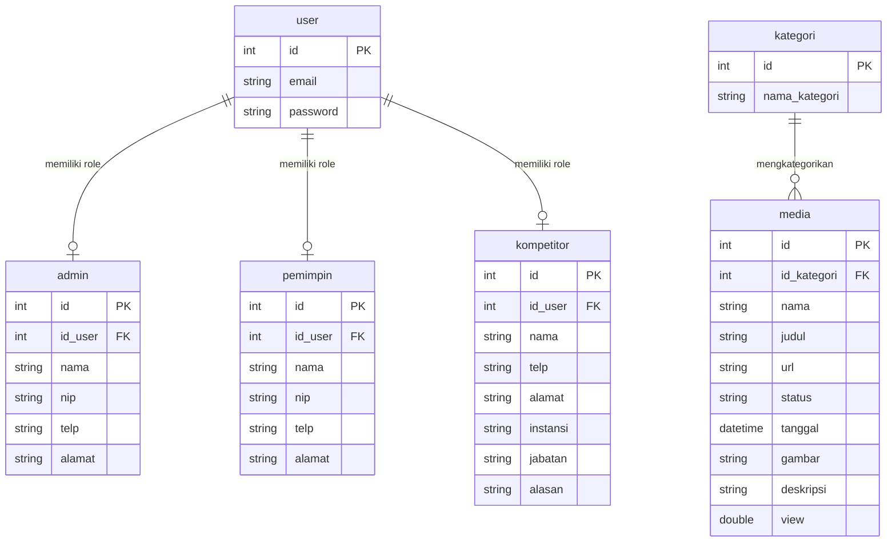

# Database Documentation & Data Dictionary
## Sistem Monitoring Media Disnaker

---

### 1. Entity Relationship Diagram (ERD)

---

### 2. Kamus Data & Skema Tabel

#### 2.1 Tabel `user`
Tabel utama autentikasi akun pengguna.
| Kolom | Tipe Data | Kunci | Deskripsi |
| :--- | :--- | :--- | :--- |
| `id` | `INT AUTO_INCREMENT` | PK | ID unik pengguna |
| `email` | `VARCHAR(255)` | - | Email pengguna (login) |
| `password` | `VARCHAR(255)` | - | Password terenkripsi (BCrypt hash) |

#### 2.2 Tabel `admin`
Tabel profil pengguna ber-role Admin.
| Kolom | Tipe Data | Kunci | Deskripsi |
| :--- | :--- | :--- | :--- |
| `id` | `INT AUTO_INCREMENT` | PK | ID unik admin |
| `id_user` | `INT` | FK | Relasi ke `user.id` |
| `nama` | `VARCHAR(255)` | - | Nama lengkap admin |
| `nip` | `VARCHAR(50)` | - | NIP pegawai admin |
| `telp` | `VARCHAR(20)` | - | Nomor telepon admin |
| `alamat` | `TEXT` | - | Alamat tempat tinggal |

#### 2.3 Tabel `pemimpin`
Tabel profil pengguna ber-role Pemimpin / Kepala Dinas.
| Kolom | Tipe Data | Kunci | Deskripsi |
| :--- | :--- | :--- | :--- |
| `id` | `INT AUTO_INCREMENT` | PK | ID unik pemimpin |
| `id_user` | `INT` | FK | Relasi ke `user.id` |
| `nama` | `VARCHAR(255)` | - | Nama lengkap pemimpin |
| `nip` | `VARCHAR(255)` | - | NIP pegawai pemimpin |
| `telp` | `VARCHAR(20)` | - | Nomor telepon pemimpin |
| `alamat` | `TEXT` | - | Alamat kantor / tempat tinggal |

#### 2.4 Tabel `kompetitor`
Tabel profil pengguna eksternal / instansi pendaftar.
| Kolom | Tipe Data | Kunci | Deskripsi |
| :--- | :--- | :--- | :--- |
| `id` | `INT AUTO_INCREMENT` | PK | ID unik kompetitor |
| `id_user` | `INT` | FK | Relasi ke `user.id` |
| `nama` | `VARCHAR(255)` | - | Nama pendaftar |
| `telp` | `VARCHAR(20)` | - | Nomor telepon pendaftar |
| `alamat` | `TEXT` | - | Alamat instansi / pendaftar |
| `instansi` | `VARCHAR(255)` | - | Nama instansi asal |
| `jabatan` | `VARCHAR(255)` | - | Jabatan pendaftar |
| `alasan` | `TEXT` | - | Alasan pendaftaran portal |

#### 2.5 Tabel `kategori`
Tabel pengelompokan topik media berita.
| Kolom | Tipe Data | Kunci | Deskripsi |
| :--- | :--- | :--- | :--- |
| `id` | `INT AUTO_INCREMENT` | PK | ID unik kategori |
| `nama_kategori` | `VARCHAR(255)` | - | Nama kategori (misal: Pelatihan, Lowongan, PHK) |

#### 2.6 Tabel `media`
Tabel utama penyimpanan data pemberitaan media.
| Kolom | Tipe Data | Kunci | Deskripsi |
| :--- | :--- | :--- | :--- |
| `id` | `INT AUTO_INCREMENT` | PK | ID unik berita media |
| `id_kategori` | `INT` | FK | Relasi ke `kategori.id` |
| `nama` | `VARCHAR(255)` | - | Nama wartawan / media penyedia |
| `judul` | `VARCHAR(255)` | - | Judul pemberitaan |
| `url` | `TEXT` | - | Link/URL sumber berita asli |
| `status` | `ENUM('disetujui', 'belum disetujui', 'tolak')` | - | Status persetujuan berita |
| `tanggal` | `DATETIME` | - | Tanggal publikasi berita |
| `gambar` | `TEXT` | - | Nama file gambar di `./uploads/` |
| `deskripsi` | `TEXT` | - | Ringkasan isi berita |
| `view` | `DOUBLE` | - | Jumlah kali berita dibaca |
