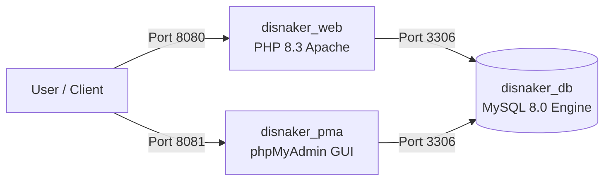

# Panduan Deployment, Docker, & CI/CD Pipeline
## Sistem Monitoring Media Disnaker

---

### 1. Kebutuhan Lingkungan Deployment
- **Docker Engine**: Versi `20.10+`
- **Docker Compose**: Versi `2.0+`
- **Port Komputer Host**: `8080` (Web), `3306` (MySQL DB), `8081` (phpMyAdmin)

---

### 2. Struktur Kontainer Docker

Aplikasi diorkestrasikan menggunakan 3 kontainer terpisah pada bridge network `disnaker_net`:



1. **`disnaker_web`**: Image berbasis `php:8.3-apache` yang telah dikonfigurasi modul `mysqli`, `pdo_mysql`, `gd`, `zip`, dan `a2enmod rewrite`.
2. **`disnaker_db`**: MySQL 8.0 yang secara otomatis mengimpor skema awal dari `disnaker-monitoring.sql` saat inisialisasi awal.
3. **`disnaker_pma`**: Web interface phpMyAdmin untuk manajemen database visual.

---

### 3. Langkah Deployment Lokal Menggunakan Docker

```bash
# 1. Clone repository proyek
git clone https://github.com/Alfaturachman/disnaker_monitoring.git
cd disnaker-monitoring

# 2. Jalankan build dan kontainer dalam mode detached (-d)
docker compose up -d --build

# 3. Verifikasi kontainer yang berjalan
docker compose ps
```

---

### 4. Pipeline CI/CD GitHub Actions (`.github/workflows/ci.yml`)

Pipeline CI/CD otomatis berjalan di cloud GitHub Runner setiap ada event `push` atau `pull_request` ke branch `main`/`master`:


- **Job 1 (PHPUnit Test)**: Menyiapkan PHP 8.3, mendownload dependensi via Composer, dan menjalankan 38 unit & feature tests.
- **Job 2 (Docker Build)**: Memastikan `Dockerfile` dapat di-build dengan sukses tanpa error dependensi.
